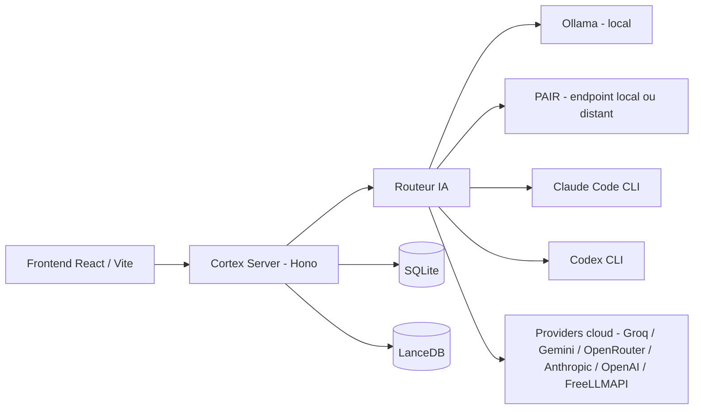

# 🧠 Docteur

> Assistant personnel qui centralise tes connaissances, tes documents et plusieurs modèles d'IA (locaux et cloud) dans une interface unique, avec un mode strictement local pour bloquer les appels cloud quand tu le souhaites.


## Table des matières

- [Aperçu](#-aperçu)
- [Qu'est-ce que Docteur ?](#-quest-ce-que-docteur-)
- [Philosophie local / hybride](#-philosophie-local--hybride)
- [Fonctionnalités principales](#-fonctionnalités-principales)
- [Architecture](#-architecture)
- [Routage IA](#-routage-ia)
- [Providers IA](#-providers-ia)
- [Mode Strict Local](#-mode-strict-local)
- [Prérequis](#-prérequis)
- [Installation](#-installation)
- [Démarrer Docteur](#-démarrer-docteur)
- [Configuration des IA](#-configuration-des-ia)
- [Sécurité et confidentialité](#-sécurité-et-confidentialité)
- [Données et stockage](#-données-et-stockage)
- [Formats supportés](#-formats-supportés)
- [Vidéo et transcription](#-vidéo-et-transcription)
- [Caméra et gestes](#-caméra-et-gestes)
- [RAG et documents](#-rag-et-documents)
- [Tests et qualité](#-tests-et-qualité)
- [Structure du projet](#-structure-du-projet)
- [Commandes utiles](#-commandes-utiles)
- [Dépannage](#-dépannage)
- [État du projet](#-état-du-projet)
- [Limitations connues](#-limitations-connues)
- [Roadmap](#-roadmap)
- [Contribuer](#-contribuer)
- [Signaler un problème de sécurité](#-signaler-un-problème-de-sécurité)
- [Licence](#-licence)
- [Technologies principales](#-technologies-principales)

## 🖼️ Aperçu


<!-- Ajouter ici une capture montrant des neurones remplis et une réponse du chat -->

## 🧠 Qu'est-ce que Docteur ?

Docteur est une application personnelle (frontend web + serveur local) qui te permet de rassembler dans un même endroit : des notes et documents (appelés **neurones**), une recherche dans ce que tu y as stocké, et l'accès à plusieurs modèles d'IA — installés sur ta machine ou fournis par un service cloud.

L'idée de départ : au lieu d'ouvrir dix outils différents (une note, un chat IA, un lecteur PDF, un résumé de vidéo…), tout passe par la même interface, avec le choix explicite d'utiliser un modèle local (Ollama) ou un modèle distant selon la tâche et tes préférences de confidentialité.

Docteur tourne en local sur ta machine : un serveur backend (`cortex-server`) répond sur `127.0.0.1`, et l'interface est une application web (React) que tu ouvres dans ton navigateur.

## 🔀 Philosophie local / hybride

- **Local** : le chat, la vision (analyse d'image), la transcription audio et la recherche dans tes neurones peuvent fonctionner entièrement sur ta machine via [Ollama](https://ollama.com), sans connexion Internet, à condition d'avoir installé les modèles nécessaires.
- **Hybride** : certaines fonctionnalités (veille/recherche web, comparaison de modèles, transcription accélérée) peuvent s'appuyer sur des services cloud si tu les configures — mais rien n'est envoyé au cloud sans que tu aies fourni une configuration (clé API, session CLI, etc.) pour ce provider.
- **Cloud optionnel** : aucun provider cloud n'est activé par défaut. Tu choisis lesquels configurer, et le [mode Strict Local](#-mode-strict-local) permet de désactiver les chemins cloud pris en charge par ce mode.

Docteur ne fonctionne pas intégralement hors ligne dès l'installation : sans Ollama installé et sans modèle local téléchargé, les fonctions IA n'ont rien à interroger.

## ✨ Fonctionnalités principales

### 🧠 Neurones et mémoire

- Création, édition et suppression de neurones (notes, liens, vidéos, CV, etc.).
- Persistance dans une base SQLite locale, avec chargement rapide au démarrage (les neurones récents d'abord, le reste à la demande).
- Liens entre neurones et navigation dans l'arborescence.
- Certains neurones peuvent être créés automatiquement par un **agent** planifié (voir plus bas), à partir d'un contenu généré par un modèle IA.

### 💬 Intelligence artificielle

- Chat avec un modèle local via Ollama.
- Un routeur central choisit ou bascule entre providers selon la disponibilité, les clés configurées et le mode Strict Local (détails dans [Routage IA](#-routage-ia)).
- Comparaison de plusieurs modèles sur la même question (« Comparaison de modèles »).

### 📚 RAG et documents

- Import documentaire générique : `.xlsx`, `.csv`, `.txt`, `.md`, `.json`, avec extraction de contenu.
- PDF : import/analyse de CV et export PDF de contenu — pas d'import PDF générique dans le corpus documentaire à ce jour.
- Recherche par similarité vectorielle dans les neurones stockés (embeddings via Ollama, index [LanceDB](https://lancedb.com/)).
- Un corpus de documents peut être découpé en fragments (chunking) pour alimenter le contexte envoyé au modèle.

### 🎥 Vidéo et transcription

- Téléchargement audio d'une vidéo (via [yt-dlp](https://github.com/yt-dlp/yt-dlp)) puis transcription et résumé.
- Transcription locale (Whisper local, découpage audio via `ffmpeg`) ou via l'API Groq (Whisper cloud) si configurée.

### 👁️ Vision

- Analyse d'image 100 % locale via Ollama (modèle `llava` par défaut), avec bascule vers l'OCR en cas de dépassement de délai.

### ✋ Caméra et gestes — 🧪 expérimental

- Reconnaissance de gestes de la main (via la caméra du navigateur) pour naviguer entre les neurones, basée sur MediaPipe.
- Fonctionnalité sensible à l'éclairage, à la position de la main et aux performances de la machine — considérée comme expérimentale.

### 🔎 Recherche et veille

- Recherche web et veille thématique, avec génération de synthèses.
- Agents planifiables (fréquence configurable) qui peuvent exécuter une tâche récurrente et déposer leur résultat sous forme de neurone.

### 🧑‍🏫 Professeur

- Module dédié à l'apprentissage : parcours pédagogiques, choix d'un modèle IA dédié (local ou cloud selon configuration), système de répétition espacée pour réviser.

### 📄 CV / candidature

- Import et analyse de CV (PDF), génération/retouche de contenu pour une candidature.

### 🪄 Prompt Generator

- Aide à la rédaction de prompts, avec sélection de provider/modèle et suivi des destinations d'envoi.

### ⚖️ Comparaison de modèles

- Envoi de la même question à plusieurs providers/modèles en parallèle pour comparer les réponses.

## 🏗️ Architecture

**Frontend** — React + TypeScript, servi par Vite. Communique avec le backend via une API HTTP locale (`http://localhost:3001` par défaut).

**Backend (`cortex-server`)** — Serveur Node.js (framework [Hono](https://hono.dev)), organisé en routes par fonctionnalité (neurones, recherche, vidéo, agents, etc.).

**Données** — SQLite (`better-sqlite3`) pour les neurones, réglages et journaux ; LanceDB pour l'index vectoriel utilisé par la recherche sémantique.

**IA** — Un routeur central (`router.js`) sélectionne un provider local ou cloud selon la configuration ; certaines fonctionnalités (veille, professeur) appellent directement un provider cloud spécifique plutôt que de passer par ce routeur (voir [Routage IA](#-routage-ia)).



## 🧭 Routage IA

La majorité des fonctionnalités passent par un routeur central qui :

1. vérifie si le **mode Strict Local** est actif (dans ce cas, seul Ollama est utilisé) ;
2. sinon, tente le provider préféré configuré, puis bascule vers d'autres providers configurés en cas d'échec (clé invalide, service indisponible, quota dépassé) ;
3. revient à un modèle local en dernier recours si aucun provider cloud n'est disponible.

Certaines fonctionnalités (la veille/recherche et le module Professeur, par exemple) appellent directement un provider cloud plutôt que de passer par ce routeur central — chacune applique néanmoins sa propre vérification du mode Strict Local avant tout appel cloud. **Le projet ne prétend pas que 100 % des chemins passent par un unique routeur.**

## 🤖 Providers IA

| Provider | Type | Authentification | Remarque |
|---|---|---|---|
| **Ollama** | Local | Aucune | Nécessite une installation séparée et au moins un modèle téléchargé |
| **Claude Code** | Abonnement (CLI) | Session officielle `claude` | ≠ Anthropic API — pas de clé requise en mode abonnement |
| **Codex** | Abonnement ChatGPT (CLI) | Session officielle `codex` | ≠ OpenAI API — pas de clé requise en mode abonnement |
| **Groq** | Cloud (API) | Clé API | |
| **Gemini** | Cloud (API) | Clé API | |
| **OpenRouter** | Cloud (API) | Clé API | |
| **Anthropic API** | Cloud (API, payant) | Clé API | Distinct de Claude Code |
| **OpenAI API** | Cloud (API, payant) | Clé API | Distinct de Codex |
| **FreeLLMAPI** | Cloud (API compatible OpenAI, optionnel) | Endpoint + clé selon l'instance | Nécessite une instance FreeLLMAPI déjà déployée séparément ; capacités déclarées limitées au texte (pas d'image/vidéo/audio dans l'intégration actuelle) |
| **PAIR** (NVIDIA) | Endpoint distribué / externe (optionnel) | Aucune (endpoint réseau) | Service d'inférence traité comme local par Docteur (alternative à Ollama) ; endpoint par défaut `localhost`, configurable vers une autre machine du réseau |

## 🔒 Mode Strict Local

Quand le mode Strict Local est activé dans les réglages, Docteur bloque l'utilisation des providers cloud sur les chemins qui vérifient ce réglage (chat, veille, professeur, génération de prompts, comparaison de modèles, etc.) et retombe sur Ollama.

Ce mode dépend des modèles réellement installés en local : si Ollama n'a pas le modèle attendu, la fonctionnalité concernée peut devenir indisponible plutôt que de basculer silencieusement vers le cloud. Le mode Strict Local n'isole pas le système au niveau réseau — il désactive les appels aux chemins applicatifs identifiés comme cloud dans le code, pas une garantie d'isolation système complète.

## 📋 Prérequis

### Obligatoires

- Windows (plateforme principale visée par les scripts fournis)
- [Node.js](https://nodejs.org/) ≥ 20
- npm

### Optionnels (selon les fonctionnalités que tu veux utiliser)

- [Ollama](https://ollama.com) — pour le chat, la vision et la recherche 100 % locaux
- [Claude Code CLI](https://github.com/anthropics/claude-code) — pour utiliser Claude via ton abonnement
- [Codex CLI](https://github.com/openai/codex) — pour utiliser Codex via ton abonnement ChatGPT
- `ffmpeg` — pour le découpage audio (transcription vidéo)
- `yt-dlp` — pour le téléchargement audio des vidéos à résumer
- Une caméra — pour la fonctionnalité expérimentale de gestes
- Des clés API — pour Groq, Gemini, OpenRouter, Anthropic API, OpenAI API si tu veux les utiliser
- Une instance FreeLLMAPI et/ou un endpoint PAIR déjà déployés, si tu veux les configurer

## 🚀 Installation

```powershell
git clone https://github.com/FloW1772/Docteur.git
cd Docteur
npm install
```

Le backend a ses propres dépendances, à installer séparément :

```powershell
cd cortex-server
npm install
```

## ▶️ Démarrer Docteur

Le dépôt fournit un launcher Windows (`Docteur-Launcher.bat`) qui propose plusieurs modes (usage local, accès réseau, mode mobile/PWA). C'est la façon la plus simple de démarrer l'ensemble (backend + frontend) sans lancer les commandes manuellement.

> Le launcher Windows peut nécessiter d'adapter son chemin de projet si le dépôt n'est pas installé à l'emplacement prévu.

### Démarrage manuel (mode développement)

Dans un premier terminal, démarre le backend :

```powershell
cd cortex-server
npm run dev
```

Dans un second terminal, démarre le frontend :

```powershell
npm run dev
```

L'interface est ensuite disponible sur `http://localhost:5173`, et communique avec le backend sur `http://localhost:3001`.

### Build

```powershell
npm run build
```

Compile le TypeScript et génère les fichiers de production dans `dist/`.

## ⚙️ Configuration des IA

La configuration des providers (clés API, endpoints, mode Strict Local, choix du modèle par fonctionnalité) se fait depuis l'écran **Réglages** de l'interface, une fois Docteur lancé — aucune clé n'est à écrire dans un fichier de configuration à la main.

### Ollama

Installe Ollama séparément, puis télécharge au moins un modèle de ton choix (`ollama pull <modèle>`). Docteur ne télécharge aucun modèle automatiquement à ta place. Aucune clé API n'est nécessaire.

### Claude Code

```powershell
npm install -g @anthropic-ai/claude-code
claude
```

La commande `claude` ouvre le flux de connexion officiel Anthropic. Docteur utilise ensuite la session CLI déjà ouverte — aucune clé `ANTHROPIC_API_KEY` n'est nécessaire en mode abonnement, et Docteur ne récupère ni ne stocke ton mot de passe. L'API Anthropic classique (payante, par clé) reste un mode séparé et distinct.

### Codex

```powershell
npm install -g @openai/codex
codex
```

La commande `codex` ouvre le flux de connexion officiel OpenAI/ChatGPT. Aucune clé `OPENAI_API_KEY` n'est nécessaire en mode abonnement. L'API OpenAI classique (payante, par clé) reste un mode séparé.

### FreeLLMAPI

Provider optionnel, compatible avec l'API OpenAI. Nécessite une instance FreeLLMAPI que tu déploies et exposes toi-même, puis son endpoint (et sa clé le cas échéant) sont à renseigner dans les réglages Docteur. La liste des modèles disponibles peut être découverte automatiquement selon ce que l'instance expose.

### Clés API

Certains providers (Groq, Gemini, OpenRouter, Anthropic API, OpenAI API) nécessitent une clé fournie par toi. Elle se configure depuis les réglages Docteur — jamais en clair dans un fichier du dépôt :

```text
YOUR_API_KEY
```

## 🛡️ Sécurité et confidentialité

- Le backend écoute sur `127.0.0.1` par défaut (pas d'exposition réseau sans configuration explicite).
- CORS restrictif avec validation d'Origin, limité aux origines de développement attendues.
- Protection contre les requêtes SSRF sur les URLs traitées côté serveur (blocage des adresses locales/privées).
- Les clés API sont chiffrées via DPAPI Windows avant stockage — jamais en clair, jamais exposées au frontend.
- Les journaux (logs) masquent automatiquement les clés et tokens détectés.
- Les appels aux CLI Claude Code et Codex se font sans interprétation shell des arguments dynamiques.
- Contrôle de taille et de format sur les fichiers importés.

**Important — ce que Docteur ne fait pas** : l'application considère la session Windows courante comme un environnement de confiance. **L'authentification d'un processus local arbitraire n'est pas prise en charge** : un programme malveillant exécuté sous le même compte Windows que Docteur sort du modèle de menace actuel (comme pour la base SQLite ou les clés chiffrées, qui restent lisibles par tout processus tournant sous ce même compte).

## 💾 Données et stockage

- Les neurones, réglages et journaux d'activité sont stockés dans une base SQLite locale (mode WAL activé).
- L'index de recherche sémantique est stocké dans LanceDB, également en local.
- Les clés API cloud sont chiffrées avant d'être écrites en base.
- Un mécanisme de sauvegarde/restauration (backup) est disponible depuis l'interface.

Aucun chemin ni identifiant personnel n'est indiqué ici : l'emplacement exact des données dépend de ton installation.

## 📁 Formats supportés

| Format | Support |
|---|---|
| `.xlsx` | ✅ |
| `.csv` | ✅ |
| `.txt` / `.md` / `.json` | ✅ |
| PDF | ✅ (import CV, export de neurones) |
| `.xls` (ancien format Excel) | ❌ |

Le format legacy `.xls` n'est plus accepté (dépendance associée retirée pour des raisons de sécurité). Convertis le fichier en `.xlsx` ou `.csv` avant import.

## 🎥 Vidéo et transcription

Pipeline simplifié :

```text
URL vidéo → téléchargement audio (yt-dlp) → découpage (ffmpeg) → transcription (Whisper local ou Groq) → résumé
```

Le temps de traitement dépend de la durée de la vidéo. Certaines plateformes peuvent bloquer le téléchargement (erreurs 403) ; Docteur n'utilise pas de cookies de navigateur pour contourner ce type de blocage.

## ✋ Caméra et gestes

🧪 **Fonction expérimentale.** La reconnaissance de gestes demande l'autorisation d'accès à la caméra dans le navigateur, et sert à naviguer entre les neurones sans clavier ni souris. La fiabilité dépend de l'éclairage, de la position de la main devant la caméra et des performances de la machine.

## 📚 RAG et documents

Docteur peut retrouver des éléments pertinents dans les connaissances déjà stockées (neurones, documents importés) afin de les ajouter au contexte envoyé au modèle IA, plutôt que de se limiter à ce que tu écris dans ta question. Cette recherche s'appuie sur des embeddings calculés localement via Ollama et un index vectoriel LanceDB.

## ✅ Tests et qualité

État constaté à la dernière vérification (suites isolées, sans appel réseau ni donnée réelle) :

- **175 tests passés, 0 échec**, répartis sur 11 suites (fallback/routage IA, providers, résolution sécurisée des CLI Codex/Claude, mode Strict Local, import de fichiers, agents externes, FreeLLMAPI, transcription vidéo, etc.).
- Build (`tsc && vite build`) : validé.
- Vérification de types (`tsc --noEmit`) : validée, 0 erreur.
- Certaines suites end-to-end (navigateur, serveur de développement déjà lancé) ne sont pas exécutées automatiquement et nécessitent un environnement complet.
- Aucun appel à un provider cloud réel n'a lieu pendant l'exécution des tests standards.

## 📁 Structure du projet

```text
Docteur/
├── src/                     # Frontend React/TypeScript
│   ├── components/
│   ├── hooks/
│   └── lib/
│
├── cortex-server/           # Backend Node.js (Hono)
│   ├── src/
│   │   ├── lib/             # Providers IA, SQLite, LanceDB, sécurité...
│   │   └── routes/          # Une route par fonctionnalité
│   └── test-*.mjs           # Suites de tests isolées
│
├── Docteur-Launcher.bat     # Lanceur Windows (menu interactif)
├── package.json
└── README.md
```

## 🧰 Commandes utiles

Frontend (racine du dépôt) :

```powershell
npm run dev              # Démarrage en mode développement
npm run dev:local        # Démarrage avec accès réseau local
npm run build             # Build de production
npm run preview           # Prévisualiser le build
```

Backend (`cortex-server/`) :

```powershell
npm run dev               # Démarrage en développement (redémarrage auto)
npm run start              # Démarrage simple
npm run check              # Vérification de démarrage du serveur
```

## 🩺 Dépannage

### `ERR_CONNECTION_REFUSED` sur le frontend

Vérifie que `cortex-server` est bien démarré (`npm run dev` dans `cortex-server/`) et qu'il écoute sur le port 3001.

### Ollama non disponible

Vérifie que le service Ollama tourne, et que le modèle attendu est bien installé (`ollama list`).

### Claude Code non détecté

```powershell
where.exe claude
claude --version
```

### Codex non détecté

```powershell
where.exe codex
codex --version
```

### Problèmes avec une vidéo (yt-dlp)

Certaines plateformes peuvent bloquer le téléchargement. Vérifie que `yt-dlp` est à jour. Docteur n'utilise pas et ne doit pas utiliser de cookies extraits d'un navigateur pour contourner ces blocages.

### FreeLLMAPI « non configuré »

Ce message signifie qu'aucun endpoint valide n'a été renseigné dans les réglages, ou que l'instance FreeLLMAPI n'est pas joignable. Une instance réelle doit être déployée séparément avant configuration.

## 🚦 État du projet

- ✅ Neurones, chat local, recherche, vidéo/transcription, RAG documentaire, mode Strict Local, routage multi-providers
- 🧪 Reconnaissance de gestes par caméra
- ⚙️ FreeLLMAPI et PAIR (nécessitent une instance externe déployée séparément)
- 🚧 Couverture de tests end-to-end encore partielle

Docteur est un projet personnel activement développé — il n'est pas présenté comme "production ready" au sens d'un logiciel distribué à grande échelle.

## ⚠️ Limitations connues

- Le format `.xls` (Excel legacy) n'est plus supporté.
- FreeLLMAPI et PAIR nécessitent chacun une instance/un endpoint externes déjà déployés — ils ne fonctionnent pas « out of the box ».
- Plusieurs providers cloud nécessitent une clé API fournie par l'utilisateur.
- La reconnaissance de gestes par caméra reste expérimentale et sensible aux conditions d'utilisation.
- L'authentification d'un processus local arbitraire n'est pas prise en charge (voir [Sécurité et confidentialité](#-sécurité-et-confidentialité)).
- Certaines suites de tests end-to-end nécessitent un environnement de développement complet et ne sont pas exécutées automatiquement.

## 🗺️ Roadmap

Pistes d'amélioration identifiées, sans garantie ni date :

- Étoffer la couverture de tests end-to-end (navigateur, serveur réel).
- Optimiser le chargement pour de très grands volumes de neurones.
- Améliorer la fiabilité de la reconnaissance de gestes.
- Ajouter ou affiner le support d'autres providers IA.
- Poursuivre le durcissement sécurité côté Windows.

## 🤝 Contribuer

Le dépôt ne contient pas encore de guide de contribution dédié. Pour proposer une modification :

1. Fork du dépôt
2. Créer une branche dédiée à ta modification
3. Faire un changement ciblé et cohérent
4. Lancer les tests concernés (`node --test <fichier>` dans `cortex-server/`, `npm run build` à la racine)
5. Ouvrir une Pull Request avec une description claire

Privilégie des commits petits et lisibles, et explique le "pourquoi" du changement dans la description.

## 🔐 Signaler un problème de sécurité

Le dépôt ne contient pas encore de fichier `SECURITY.md` dédié. Si tu identifies une vulnérabilité, merci de ne jamais la publier avec des secrets, tokens ou données personnelles, et de contacter le mainteneur du dépôt directement plutôt que d'ouvrir une issue publique détaillée.

## 📜 Licence

Le dépôt ne contient actuellement pas de fichier de licence explicite.

## ❤️ Technologies principales

React · TypeScript · Vite · Node.js · Hono · SQLite (better-sqlite3) · LanceDB · Ollama · Pino

---

Docteur est construit autour d'une idée simple : laisser l'utilisateur choisir où ses données sont traitées et quels modèles il souhaite utiliser.
