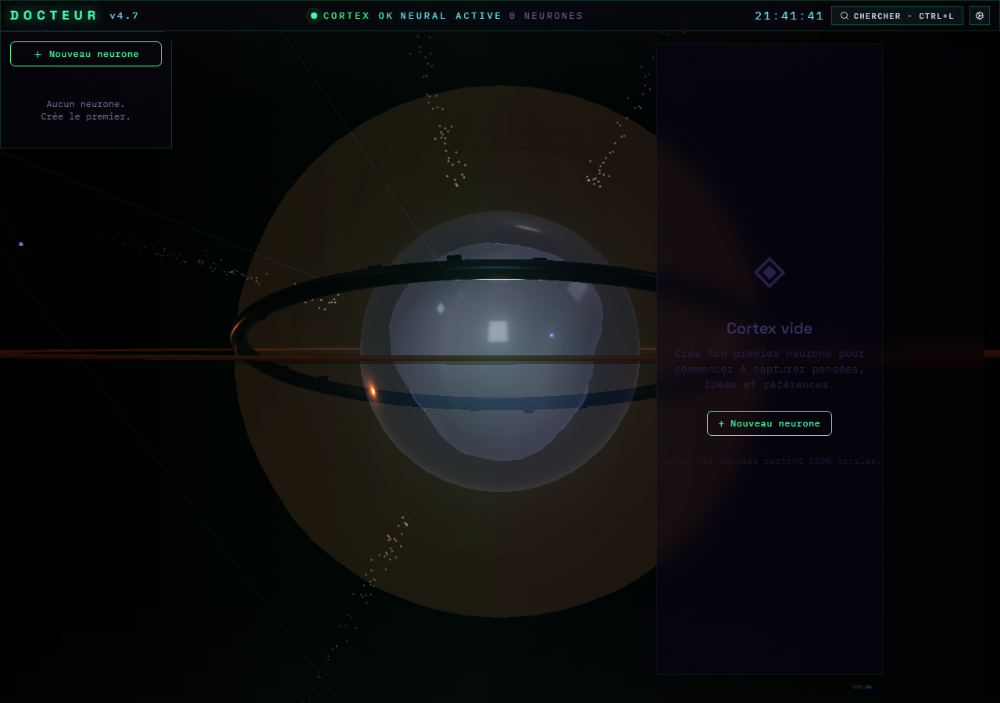
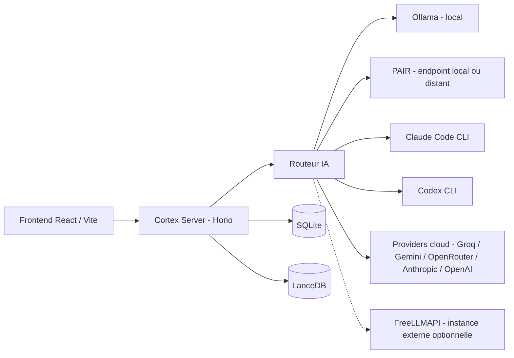

# 🧠 Docteur

> Assistant IA personnel local et hybride pour organiser tes connaissances, interroger plusieurs modèles et automatiser tes tâches depuis une seule interface.

<p align="center">
  = 20">
  
  
  
  
  
</p>

<p align="center">
  
</p>

## ✨ Pourquoi Docteur ?

🧠 **Mémoire personnelle**
Neurones, documents, recherche sémantique et connaissances centralisées dans une base locale.

🔒 **Local-first**
Chat, vision, transcription et embeddings peuvent tourner entièrement sur ta machine via Ollama, sans connexion Internet.

🤖 **Multi-provider**
Claude Code, Codex, Groq, Gemini, OpenRouter, Anthropic API, OpenAI API et autres intégrations configurables.

🧭 **Mode Strict Local**
Bloque les chemins applicatifs identifiés comme cloud lorsqu'il est activé, pour garder le contrôle sur où vont tes données.

⚙️ **Automatisation**
Agents planifiables, veille thématique, génération de prompts et outils spécialisés (CV, professeur).

🎥 **Multimédia**
Résumé vidéo, transcription, analyse d'image et OCR.

## 🚀 Démarrage rapide

```powershell
git clone https://github.com/FloW1772/Docteur.git
cd Docteur
npm install
cd cortex-server
npm install
```

Puis démarre le backend (`npm run dev` dans `cortex-server/`) et le frontend (`npm run dev` à la racine) dans deux terminaux, ou utilise le launcher Windows fourni (`Docteur-Launcher.bat`).

> [!NOTE]
> Le launcher Windows peut nécessiter d'adapter son chemin de projet si le dépôt n'est pas installé à l'emplacement prévu.

Détails complets dans la section [Installation](#-installation-détaillée) plus bas.

<details>
<summary><strong>📚 Table des matières</strong></summary>

- [Qu'est-ce que Docteur ?](#-quest-ce-que-docteur-)
- [Fonctionnalités principales](#-fonctionnalités-principales)
- [Architecture](#-architecture)
- [Providers IA](#-providers-ia)
- [Routage IA](#-routage-ia)
- [Mode Strict Local](#-mode-strict-local)
- [Installation détaillée](#-installation-détaillée)
- [Configuration des IA](#-configuration-des-ia)
- [Données et stockage](#-données-et-stockage)
- [Sécurité et confidentialité](#-sécurité-et-confidentialité)
- [Formats supportés](#-formats-supportés)
- [Vidéo et transcription](#-vidéo-et-transcription)
- [Caméra et gestes](#-caméra-et-gestes)
- [RAG et documents](#-rag-et-documents)
- [Tests et qualité](#-tests-et-qualité)
- [Structure du projet](#-structure-du-projet)
- [Commandes utiles](#-commandes-utiles)
- [Dépannage](#-dépannage)
- [État du projet](#-état-du-projet)
- [Limitations connues](#-limitations-connues)
- [Roadmap](#-roadmap)
- [Contribuer](#-contribuer)
- [Signaler un problème de sécurité](#-signaler-un-problème-de-sécurité)
- [Licence](#-licence)
- [Technologies principales](#-technologies-principales)

</details>

## 🧠 Qu'est-ce que Docteur ?

Docteur est une application personnelle (frontend web + serveur local) qui rassemble dans un même endroit : des notes et documents (appelés **neurones**), une recherche dans ce que tu y as stocké, et l'accès à plusieurs modèles d'IA — installés sur ta machine ou fournis par un service cloud.

L'idée de départ : au lieu d'ouvrir dix outils différents (une note, un chat IA, un lecteur PDF, un résumé de vidéo…), tout passe par la même interface, avec le choix explicite d'utiliser un modèle local (Ollama) ou un modèle distant selon la tâche et tes préférences de confidentialité.

Docteur tourne en local sur ta machine : un serveur backend (`cortex-server`) répond sur `127.0.0.1`, et l'interface est une application web (React) que tu ouvres dans ton navigateur.

Docteur ne fonctionne pas intégralement hors ligne dès l'installation : sans Ollama installé et sans modèle local téléchargé, les fonctions IA n'ont rien à interroger.

## ✨ Fonctionnalités principales

### 🧠 Connaissances

- Création, édition et suppression de neurones (notes, liens, vidéos, CV, etc.), avec liens entre eux.
- Persistance SQLite locale, avec chargement rapide au démarrage (neurones récents d'abord, reste à la demande).
- Recherche par similarité vectorielle (embeddings Ollama, index LanceDB).
- Import documentaire : `.xlsx`, `.csv`, `.txt`, `.md`, `.json`, avec chunking pour le contexte envoyé au modèle.

### 🤖 IA

- Chat avec un modèle local via Ollama.
- Routeur central qui choisit ou bascule entre providers selon disponibilité, clés configurées et mode Strict Local.
- Comparaison de plusieurs modèles sur la même question.
- Support Claude Code, Codex et providers API (Groq, Gemini, OpenRouter, Anthropic, OpenAI, FreeLLMAPI, PAIR).

### ⚙️ Outils

- Agents planifiables qui exécutent une tâche récurrente et déposent leur résultat sous forme de neurone.
- Veille thématique et recherche web avec génération de synthèses.
- Module Professeur : parcours pédagogiques, répétition espacée, modèle IA dédié.
- Prompt Generator : aide à la rédaction de prompts avec sélection de provider/modèle.
- Import/analyse de CV (PDF) et génération de contenu pour candidature.

### 🎥 Multimédia

- Résumé vidéo : téléchargement audio (yt-dlp), transcription (Whisper local ou Groq cloud), résumé.
- Analyse d'image 100 % locale via Ollama (`llava` par défaut), avec bascule OCR en cas de dépassement de délai.
- Reconnaissance de gestes par caméra — 🧪 expérimental.

## 🏗️ Architecture

**Frontend** — React + TypeScript, servi par Vite. Communique avec le backend via une API HTTP locale (`http://localhost:3001` par défaut).

**Cortex Server** — Serveur Node.js (framework [Hono](https://hono.dev)), organisé en routes par fonctionnalité (neurones, recherche, vidéo, agents, etc.).

**Données** — SQLite (`better-sqlite3`) pour les neurones, réglages et journaux ; [LanceDB](https://lancedb.com/) pour l'index vectoriel utilisé par la recherche sémantique.

**IA** — Un routeur central (`router.js`) sélectionne un provider local ou cloud selon la configuration ; certaines fonctionnalités (veille, professeur) appellent directement un provider cloud spécifique plutôt que de passer par ce routeur (voir [Routage IA](#-routage-ia)).



## 🤖 Providers IA

| Provider | Type | Auth | Usage |
|---|---|---|---|
| **Ollama** | Local | Aucune | Nécessite une installation séparée et au moins un modèle téléchargé |
| **Claude Code** | Abonnement (CLI) | Session officielle `claude` | ≠ Anthropic API — pas de clé requise en mode abonnement |
| **Codex** | Abonnement ChatGPT (CLI) | Session officielle `codex` | ≠ OpenAI API — pas de clé requise en mode abonnement |
| **Groq** | Cloud (API) | Clé API | |
| **Gemini** | Cloud (API) | Clé API | |
| **OpenRouter** | Cloud (API) | Clé API | |
| **Anthropic API** | Cloud (API, payant) | Clé API | Distinct de Claude Code |
| **OpenAI API** | Cloud (API, payant) | Clé API | Distinct de Codex |
| **FreeLLMAPI** | Cloud (API compatible OpenAI, optionnel) | Endpoint + clé selon l'instance | Instance à déployer séparément ; capacités limitées au texte (pas d'image/vidéo/audio) |
| **PAIR** (NVIDIA) | Endpoint distribué / local (optionnel) | Aucune (endpoint réseau) | Traité comme local par Docteur (alternative à Ollama) ; endpoint par défaut `localhost`, configurable vers une autre machine |

## 🧭 Routage IA

La majorité des fonctionnalités passent par un routeur central qui :

1. vérifie si le **mode Strict Local** est actif (dans ce cas, seul Ollama est utilisé) ;
2. sinon, tente le provider préféré configuré, puis bascule vers d'autres providers configurés en cas d'échec (clé invalide, service indisponible, quota dépassé) ;
3. revient à un modèle local en dernier recours si aucun provider cloud n'est disponible.

Certaines fonctionnalités (la veille/recherche et le module Professeur, par exemple) appellent directement un provider cloud plutôt que de passer par ce routeur central — chacune applique néanmoins sa propre vérification du mode Strict Local avant tout appel cloud. **Le projet ne prétend pas que 100 % des chemins passent par un unique routeur.**

## 🔒 Mode Strict Local

> [!IMPORTANT]
> Le mode Strict Local bloque les chemins cloud identifiés dans l'application. Il ne constitue pas une isolation réseau du système entier.

Quand ce mode est activé dans les réglages, Docteur bloque l'utilisation des providers cloud sur les chemins qui vérifient ce réglage (chat, veille, professeur, génération de prompts, comparaison de modèles, etc.) et retombe sur Ollama.

Ce mode dépend des modèles réellement installés en local : si Ollama n'a pas le modèle attendu, la fonctionnalité concernée peut devenir indisponible plutôt que de basculer silencieusement vers le cloud.

## 🚀 Installation détaillée

### Prérequis obligatoires

- Windows (plateforme principale visée par les scripts fournis)
- [Node.js](https://nodejs.org/) ≥ 20
- npm

### Prérequis optionnels (selon les fonctionnalités souhaitées)

- [Ollama](https://ollama.com) — pour le chat, la vision et la recherche 100 % locaux
- [Claude Code CLI](https://github.com/anthropics/claude-code) — pour utiliser Claude via ton abonnement
- [Codex CLI](https://github.com/openai/codex) — pour utiliser Codex via ton abonnement ChatGPT
- `ffmpeg` — pour le découpage audio (transcription vidéo)
- [`yt-dlp`](https://github.com/yt-dlp/yt-dlp) — pour le téléchargement audio des vidéos à résumer
- Une caméra — pour la fonctionnalité expérimentale de gestes
- Des clés API — pour Groq, Gemini, OpenRouter, Anthropic API, OpenAI API si tu veux les utiliser
- Une instance FreeLLMAPI et/ou un endpoint PAIR déjà déployés, si tu veux les configurer

### Frontend et backend

```powershell
git clone https://github.com/FloW1772/Docteur.git
cd Docteur
npm install
cd cortex-server
npm install
```

### Démarrage manuel (mode développement)

Dans un premier terminal, démarre le backend :

```powershell
cd cortex-server
npm run dev
```

Dans un second terminal, démarre le frontend :

```powershell
npm run dev
```

L'interface est ensuite disponible sur `http://localhost:5173`, et communique avec le backend sur `http://localhost:3001`.

### Launcher Windows

Le dépôt fournit un launcher Windows (`Docteur-Launcher.bat`) qui propose plusieurs modes (usage local, accès réseau, mode mobile/PWA) et démarre l'ensemble (backend + frontend) sans lancer les commandes manuellement.

> [!NOTE]
> Le launcher peut nécessiter d'adapter son chemin de projet si le dépôt n'est pas installé à l'emplacement prévu.

### Build

```powershell
npm run build
```

Compile le TypeScript et génère les fichiers de production dans `dist/`.

## ⚙️ Configuration des IA

La configuration des providers (clés API, endpoints, mode Strict Local, choix du modèle par fonctionnalité) se fait depuis l'écran **Réglages** de l'interface, une fois Docteur lancé — aucune clé n'est à écrire dans un fichier de configuration à la main.

### Ollama

Installe Ollama séparément, puis télécharge au moins un modèle de ton choix (`ollama pull <modèle>`). Docteur ne télécharge aucun modèle automatiquement à ta place. Aucune clé API n'est nécessaire.

### Claude Code

```powershell
npm install -g @anthropic-ai/claude-code
claude
```

La commande `claude` ouvre le flux de connexion officiel Anthropic. Docteur utilise ensuite la session CLI déjà ouverte — aucune clé `ANTHROPIC_API_KEY` n'est nécessaire en mode abonnement, et Docteur ne récupère ni ne stocke ton mot de passe. L'API Anthropic classique (payante, par clé) reste un mode séparé et distinct.

### Codex

```powershell
npm install -g @openai/codex
codex
```

La commande `codex` ouvre le flux de connexion officiel OpenAI/ChatGPT. Aucune clé `OPENAI_API_KEY` n'est nécessaire en mode abonnement. L'API OpenAI classique (payante, par clé) reste un mode séparé.

### FreeLLMAPI

Provider optionnel, compatible avec l'API OpenAI. Nécessite une instance FreeLLMAPI que tu déploies et exposes toi-même, puis son endpoint (et sa clé le cas échéant) sont à renseigner dans les réglages Docteur. La liste des modèles disponibles peut être découverte automatiquement selon ce que l'instance expose.

### Clés API

Certains providers (Groq, Gemini, OpenRouter, Anthropic API, OpenAI API) nécessitent une clé fournie par toi. Elle se configure depuis les réglages Docteur — jamais en clair dans un fichier du dépôt :

```text
YOUR_API_KEY
```

## 💾 Données et stockage

- Les neurones, réglages et journaux d'activité sont stockés dans une base SQLite locale (mode WAL activé).
- L'index de recherche sémantique est stocké dans LanceDB, également en local.
- Les clés API cloud sont chiffrées avant d'être écrites en base.
- Un mécanisme de sauvegarde/restauration (backup) est disponible depuis l'interface.

Aucun chemin ni identifiant personnel n'est indiqué ici : l'emplacement exact des données dépend de ton installation.

## 🛡️ Sécurité et confidentialité

- Le backend écoute sur `127.0.0.1` par défaut (pas d'exposition réseau sans configuration explicite).
- CORS restrictif avec validation d'Origin, limité aux origines de développement attendues.
- Protection contre les requêtes SSRF sur les URLs traitées côté serveur (blocage des adresses locales/privées).
- Les clés API sont chiffrées via DPAPI Windows avant stockage — jamais en clair, jamais exposées au frontend.
- Les journaux (logs) masquent automatiquement les clés et tokens détectés.
- Les appels aux CLI Claude Code et Codex se font sans interprétation shell des arguments dynamiques.
- Contrôle de taille et de format sur les fichiers importés.

> [!IMPORTANT]
> Docteur considère la session Windows courante comme un environnement de confiance.

**L'authentification d'un processus local arbitraire n'est pas prise en charge** : un programme malveillant exécuté sous le même compte Windows que Docteur sort du modèle de menace actuel (comme pour la base SQLite ou les clés chiffrées, qui restent lisibles par tout processus tournant sous ce même compte).

## 📁 Formats supportés

| Format | Support |
|---|---|
| `.xlsx` | ✅ |
| `.csv` | ✅ |
| `.txt` / `.md` / `.json` | ✅ |
| PDF | ✅ limité aux fonctions documentées (import/analyse de CV, export de neurones) |
| `.xls` (ancien format Excel) | ❌ |

Il n'y a pas d'import PDF générique dans le corpus documentaire à ce jour. Le format legacy `.xls` n'est plus accepté (dépendance associée retirée pour des raisons de sécurité) — convertis le fichier en `.xlsx` ou `.csv` avant import.

## 🎥 Vidéo et transcription

Pipeline simplifié :

```text
URL vidéo → téléchargement audio (yt-dlp) → découpage (ffmpeg) → transcription (Whisper local ou Groq) → résumé
```

Le temps de traitement dépend de la durée de la vidéo. Certaines plateformes peuvent bloquer le téléchargement (erreurs 403) ; Docteur n'utilise pas de cookies de navigateur pour contourner ce type de blocage.

## ✋ Caméra et gestes

🧪 **Fonction expérimentale.** La reconnaissance de gestes de la main (via la caméra du navigateur, basée sur MediaPipe) sert à naviguer entre les neurones sans clavier ni souris. La fiabilité dépend de l'éclairage, de la position de la main devant la caméra et des performances de la machine.

## 📚 RAG et documents

Docteur peut retrouver des éléments pertinents dans les connaissances déjà stockées (neurones, documents importés) afin de les ajouter au contexte envoyé au modèle IA, plutôt que de se limiter à ce que tu écris dans ta question. Cette recherche s'appuie sur des embeddings calculés localement via Ollama et un index vectoriel LanceDB.

## ✅ Tests et qualité

État constaté à la dernière vérification (suites isolées, sans appel réseau ni donnée réelle) :

| Vérification | Résultat |
|---|---|
| Tests standards | ✅ 175 / 175, 11 suites |
| Build (`tsc && vite build`) | ✅ |
| TypeScript (`tsc --noEmit`) | ✅ 0 erreur |
| Appels cloud pendant les tests standards | ✅ 0 |
| Couverture end-to-end | 🚧 Partielle |

Les suites couvrent notamment : fallback/routage IA, providers, résolution sécurisée des CLI Codex/Claude, mode Strict Local, import de fichiers, agents externes, FreeLLMAPI, transcription vidéo. Certaines suites end-to-end (navigateur, serveur de développement déjà lancé) ne sont pas exécutées automatiquement et nécessitent un environnement complet.

Les tests unitaires/intégration ne remplacent pas une validation end-to-end complète.

## 📁 Structure du projet

```text
Docteur/
├── src/                     # Frontend React/TypeScript
│   ├── components/
│   ├── hooks/
│   └── lib/
│
├── cortex-server/           # Backend Node.js (Hono)
│   ├── src/
│   │   ├── lib/             # Providers IA, SQLite, LanceDB, sécurité...
│   │   └── routes/          # Une route par fonctionnalité
│   └── test-*.mjs           # Suites de tests isolées
│
├── Docteur-Launcher.bat     # Lanceur Windows (menu interactif)
├── package.json
└── README.md
```

## 🧰 Commandes utiles

Frontend (racine du dépôt) :

```powershell
npm run dev              # Démarrage en mode développement
npm run dev:local        # Démarrage avec accès réseau local
npm run build             # Build de production
npm run preview           # Prévisualiser le build
```

Backend (`cortex-server/`) :

```powershell
npm run dev               # Démarrage en développement (redémarrage auto)
npm run start              # Démarrage simple
npm run check              # Vérification de démarrage du serveur
```

## 🩺 Dépannage

### `ERR_CONNECTION_REFUSED` sur le frontend

Vérifie que `cortex-server` est bien démarré (`npm run dev` dans `cortex-server/`) et qu'il écoute sur le port 3001.

### Ollama non disponible

Vérifie que le service Ollama tourne, et que le modèle attendu est bien installé (`ollama list`).

### Claude Code non détecté

```powershell
where.exe claude
claude --version
```

### Codex non détecté

```powershell
where.exe codex
codex --version
```

### Problèmes avec une vidéo (yt-dlp)

Certaines plateformes peuvent bloquer le téléchargement. Vérifie que `yt-dlp` est à jour. Docteur n'utilise pas et ne doit pas utiliser de cookies extraits d'un navigateur pour contourner ces blocages.

### FreeLLMAPI « non configuré »

Ce message signifie qu'aucun endpoint valide n'a été renseigné dans les réglages, ou que l'instance FreeLLMAPI n'est pas joignable. Une instance réelle doit être déployée séparément avant configuration.

## 🚦 État du projet

| Composant | État |
|---|---|
| Neurones | ✅ |
| Chat local | ✅ |
| RAG | ✅ |
| Vidéo / transcription | ✅ |
| Providers multiples | ✅ |
| Strict Local | ✅ |
| Gestes caméra | 🧪 |
| FreeLLMAPI | ⚙️ nécessite configuration |
| PAIR | ⚙️ nécessite endpoint |
| End-to-end complet | 🚧 |

Docteur est un projet personnel activement développé — il n'est pas présenté comme « production ready » au sens d'un logiciel distribué à grande échelle.

## ⚠️ Limitations connues

- Le format `.xls` (Excel legacy) n'est plus supporté.
- FreeLLMAPI et PAIR nécessitent chacun une instance/un endpoint externes déjà déployés — ils ne fonctionnent pas « out of the box ».
- Plusieurs providers cloud nécessitent une clé API fournie par l'utilisateur.
- La reconnaissance de gestes par caméra reste expérimentale et sensible aux conditions d'utilisation.
- L'authentification d'un processus local arbitraire n'est pas prise en charge (voir [Sécurité et confidentialité](#-sécurité-et-confidentialité)).
- Certaines suites de tests end-to-end nécessitent un environnement de développement complet et ne sont pas exécutées automatiquement.

## 🗺️ Roadmap

Pistes d'amélioration identifiées, sans garantie ni date :

- Étoffer la couverture de tests end-to-end (navigateur, serveur réel).
- Optimiser le chargement pour de très grands volumes de neurones.
- Améliorer la fiabilité de la reconnaissance de gestes.
- Ajouter ou affiner le support d'autres providers IA.
- Poursuivre le durcissement sécurité côté Windows.

## 🤝 Contribuer

Le dépôt ne contient pas encore de guide de contribution dédié. Pour proposer une modification :

1. Fork du dépôt.
2. Crée une branche dédiée à ta modification.
3. Fais un changement ciblé et cohérent.
4. Lance les tests concernés (`node --test <fichier>` dans `cortex-server/`, `npm run build` à la racine).
5. Ouvre une Pull Request avec une description claire.

## 🔐 Signaler un problème de sécurité

Le dépôt ne contient pas encore de fichier `SECURITY.md` dédié. Si tu identifies une vulnérabilité, merci de ne jamais la publier avec des secrets, tokens ou données personnelles, et de contacter le mainteneur du dépôt directement plutôt que d'ouvrir une issue publique détaillée.

## 📜 Licence

> Le dépôt ne contient actuellement pas de licence explicite. En l'absence de licence, aucun droit de réutilisation n'est accordé automatiquement.

## ❤️ Technologies principales

React · TypeScript · Vite · Node.js · Hono · SQLite (better-sqlite3) · LanceDB · Ollama · Pino

---

Docteur est construit autour d'une idée simple : laisser l'utilisateur choisir où ses données sont traitées et quels modèles il souhaite utiliser.
